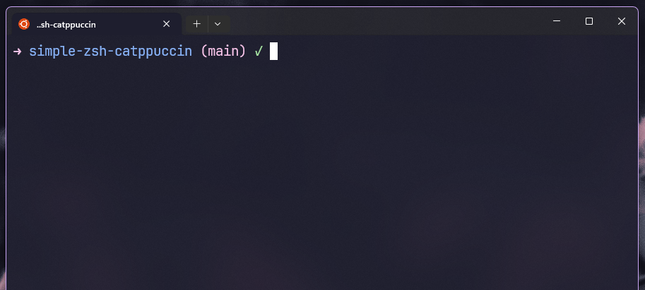

# Simple ZSH Catppuccin



A customized ZSH theme based on the Catppuccin Mocha color scheme, adapted from the Dracula theme foundation. This theme features a simple and functional prompt with support for git status, time display, context, and directory information, enhanced with hex color support discovered by ezswan.

## Overview

This theme is an adaptation of the original Dracula theme, tailored to the Catppuccin Mocha palette. Key features include:

- Dynamic arrow color changes based on command success (pink), failure (red), or vi mode (yellow).
- Support for hex colors, allowing for precise color customization.
- Asynchronous git status integration.
- Configurable options for time, context, new lines, and full directory paths.

## Color Scheme

This theme uses the Catppuccin Mocha palette with hex colors. The following colors are applied:

- Pink: #f5c2e7 (success indicator)
- Red: #f38ba8 (failure indicator)
- Yellow: #f9e2af (vi mode and custom variable)
- Teal: #94e2d5 (time segment)
- Mauve: #cba6f7 (context segment)
- Blue: #89b4fa (directory segment)
- Green: #a6e3a1 (clean git status)

## Usage

The arrow (➜) changes color based on the last command's exit status:

- Pink (#f5c2e7): Successful command.
- Red (#f38ba8): Failed command.
- Yellow (#f9e2af): Active vi command mode.

Git status is displayed asynchronously in pink (#f5c2e7) with green (#a6e3a1) for clean and yellow (#f9e2af) for dirty states.

Time, context, and directory segments are color-coded for readability.

## Installation

1. **Clone the Repository**:

   git clone <https://github.com/ezswan/simple-zsh-catppuccin.git> into a location of your choice.

   `git clone https://github.com/ezswan/simple-zsh-catppuccin.git "your-path"`

2. **Copy ~/your-path/simple-zsh-catppuccin/lib to ~/.oh-my-zsh/custom/themes/**

   `cp -r ~/your-path/simple-zsh-catppuccin/lib ~/.oh-my-zsh/custom/themes/`

3. **Symlink from theme file to .oh-my-zsh**

   `ln -s /path/to/catppuccin-mocha.zsh-theme ~/.oh-my-zsh/custom/themes/catppuccin-mocha.zsh-theme`<br>
   _(Replace /path/to/ with the actual path to the cloned theme file)_

4. **Set the theme in .zshrc**

   `ZSH_THEME="catppuccin-mocha"`

5. **Reload ZSH**

   `source ~/.zshrc`

## Options

Every option is an environment variable. Set it in `~/.zshrc` **before** Oh My Zsh
is sourced (above the `source $ZSH/oh-my-zsh.sh` line), because the prompt is built
when the theme loads. Any variable you leave unset falls back to the default below.

| Option                        | Default   | Effect                                              |
| ----------------------------- | --------- | --------------------------------------------------- |
| `CATPPUCCIN_DISPLAY_GIT`      | `1`       | Git branch/status segment (`0` disables it)         |
| `CATPPUCCIN_DISPLAY_TIME`     | `0`       | Show the current time                               |
| `CATPPUCCIN_TIME_FORMAT`      | `%-H:%M`  | `strftime` format for the time segment              |
| `CATPPUCCIN_DISPLAY_CONTEXT`  | `0`       | Show `user` (or `user@host` on SSH / as root)       |
| `CATPPUCCIN_DISPLAY_FULL_CWD` | `0`       | Full path instead of just the folder name           |
| `CATPPUCCIN_DIR_TRIM`         | `0`       | Trailing dirs to keep in full-path mode (`0` = all) |
| `CATPPUCCIN_DISPLAY_NEW_LINE` | `0`       | Put command input on its own line                   |
| `CATPPUCCIN_ARROW_ICON`       | `➜`       | Prompt arrow icon                                   |
| `CATPPUCCIN_CUSTOM_VARIABLE`  | _(unset)_ | Show this text as a yellow segment                  |
| `CATPPUCCIN_GIT_NOLOCK`       | _auto_    | Pass git `--no-optional-locks` (auto on git ≥ 2.14) |

In 12-hour (AM/PM) locales, `CATPPUCCIN_TIME_FORMAT` defaults to `%-I:%M%p`.

### Example

```sh
# ~/.zshrc — place these above `source $ZSH/oh-my-zsh.sh`
CATPPUCCIN_DISPLAY_TIME=1
CATPPUCCIN_DISPLAY_CONTEXT=1
CATPPUCCIN_DISPLAY_FULL_CWD=1
CATPPUCCIN_DIR_TRIM=2
CATPPUCCIN_ARROW_ICON='➜ '
```

## Credits

### Original Authors

Zeno Rocha <hi@zenorocha.com>
Avalon Williams <avalonwilliams@protonmail.com> (Dracula Theme foundation)

### Adapter and Modifier

ezswan <ezswan@proton.me> (Adapted the Catppuccin Mocha Theme, implemented the pink color fix replacing green, and discovered hex color support)

## License

This theme is licensed under the MIT License. See <http://zenorocha.mit-license.org> for details.

## Contributing

Feel free to submit issues or pull requests on the GitHub repository. Suggestions for new features or color schemes are welcome!

## Acknowledgments

Thanks to the Catppuccin project for the inspiring Mocha palette and the Dracula theme community for the original framework.
